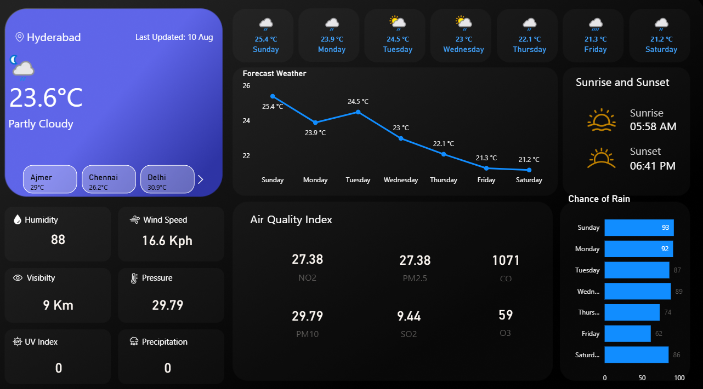

# 🌤️ Real-time Weather Dashboard in Power BI

A visually rich, real-time **Weather & Air Quality Dashboard** built with **Power BI** and **WeatherAPI**.  
It provides live weather metrics, forecasts, air quality data, and more — all updated dynamically.

---

## 📌 Features

- **Current Weather Conditions**: Temperature, weather description, and city selector.
- **City Switching**: Quickly switch between multiple cities (Hyderabad, Ajmer, Chennai, Delhi, etc.).
- **7-Day Forecast**: Temperature trends and weather icons for upcoming days.
- **Sunrise & Sunset Times**: Auto-updated daily.
- **Humidity, Wind Speed, Visibility, Pressure, UV Index, Precipitation**.
- **Air Quality Index (AQI)** with pollutants:
  - NO₂  
  - PM2.5  
  - PM10  
  - SO₂  
  - CO  
  - O₃
- **Chance of Rain**: Daily percentage bars.

---

## 🛠️ Tech Stack

- **Power BI Desktop**
- **WeatherAPI.com** (Live weather & AQI data)

---

## 📡 Data Source & API

Weather data is fetched from [WeatherAPI.com](https://www.weatherapi.com/) using their REST API.

